# 浏览器的 HTTP 缓存体系

> 本文将详细介绍浏览器的 HTTP 缓存体系，希望通过体系化的思考，让本人与读者对浏览器的 HTTP 缓存这一知识点有更深入的了解。
>

## 前言

说起浏览器的 HTTP 缓存，总会提到强缓存、协商缓存、新鲜度、Cache-Control、Expires、If-Modified-Since、If-None-Match、Last-Modified、ETags 等词语，它们对我来说既熟悉又陌生，总是记了又忘，忘了再记。归根到底是自己没有形成一个体系化的认知。

前不久看到了一篇文章[《彻底弄懂浏览器缓存策略-基于缓存策略三要素分解法》](https://mp.weixin.qq.com/s/qOMO0LIdA47j3RjhbCWUEQ)，虽然时间久远，但是文中提出的缓存三大策略，即存储策略、过期策略、对比策略，让我有了一个系统学习缓存知识的路径，我也将基于这个思路，记录我的学习内容。

在学习缓存相关的知识前，要先明确一件事，浏览器为什么要缓存 HTTP 响应？无非是以下三件事：

- 减少网络流量，节省带宽；
- 减少回源请求次数，减轻服务器负载；
- 提高页面加载速度，优化用户体验；

## 三大策略

我修改了缓存策略三要素的说法，将浏览器的 HTTP 缓存体系概括为以下三个部分：

- 缓存存储策略：响应是否可以被缓存、在哪些地方被缓存、缓存多久；
- 缓存校验策略：已存在的缓存是否可用、是否过期；
- 缓存对比策略：服务端如何对比客户端缓存与源站资源；

## 缓存存储策略

如上文所说，缓存存储策略是为了解决响应是否可以被缓存的问题。这一般取决于服务端的设置，或遵循浏览器的默认行为。

### Cache-Control & Expires

缓存存储策略受响应的 `Cache-Control` 头或 `Expires` 头的控制。`Cache-Control` 的取值 `max-age`、`no-cache`、`no-store` 都是用来指明响应内容是否可以被浏览器缓存的，其中前 2 种取值都会缓存文件数据（`no-cache` 应理解为“不建议使用本地缓存”，其仍然会缓存数据到本地），`no-store` 则不会在浏览器缓存任何响应数据。


> `Cache-Control` 的取值有很多，且要区别 request Cache-Control 与 response Cache-Control。仅对于 response Cache-Control 来说，有如下几类取值：
>
> | 分类             | 取值                             | 含义                                                         |
> | ---------------- | -------------------------------- | ------------------------------------------------------------ |
> | 基本缓存控制指令 | no-store                         | 绝对禁止缓存数据                                             |
> |                  | no-cache                         | 响应可以被缓存，但在使用之前必须重新验证其有效性             |
> |                  | public                           | 响应可以被任何缓存区缓存                                     |
>|                  | private                          | 响应只能被单个用户的浏览器缓存，不适用于共享缓存（如代理服务器） |
> | 过期控制指令     | max-age=[seconds]                | 指定一个时间长度，在这段时间内，缓存被认为是新鲜的           |
> |                  | s-maxage=[seconds]               | 类似于 `max-age`，但仅适用于共享缓存                         |
> |                  | must-revalidate                  | 一旦缓存过期（即超过 `max-age`），必须去服务器验证是否有更新 |
> |                  | proxy-revalidate                 | 与 `must-revalidate` 类似，但仅适用于共享缓存                |
> | 其他指令         | immutable                        | 响应正文不会随时间改变，直到过期                             |
>|                  | stale-while-revalidate=[seconds] | 后台异步检查缓存时，客户端使用过期缓存的时间                 |
> |                  | stale-if-error=[seconds]         | 如果重新验证缓存时服务器出错，客户端使用过期缓存的时间       |
> 
> 由于本文主要关注浏览器的缓存机制，因此需详细了解 `no-cache`、`no-store`、`max-age` 以及 `public`、`private` 这几种取值。


我在本地搭建了一个简单的场景进行验证:

```html
<!DOCTYPE html>
<html lang="en">
<head>
  <meta charset="UTF-8">
  <meta name="viewport" content="width=device-width, initial-scale=1.0">
  <title>Client 1</title>
</head>
<body>
  
  <script>
    (async function() {
      const response = await fetch('http://localhost/test-request');
      const data = await response.json();
      
      console.log(data);
    })();
  </script>
</body>
</html>


```


分别使用 `` 标签和 `fetch` API 去获取远程资源。对于图片资源，我需要浏览器缓存长一点时间，对于 JSON 数据，我需要浏览器缓存短一点时间，因此我在 Server 端对响应设置了不同的 `Cache-Control`:

```js
router.get('/:path*/test-image', async (ctx) => {
    ...
    
    ctx.type = 'image/jpeg';
    ctx.set('Cache-Control', 'max-age=3600');

    ...
})

router.all('/:path*/test-request', async (ctx) => {
    ...

    ctx.type = 'json';
    ctx.set('Cache-Control', 'max-age=60');

    ...
});
```

再次请求页面时，发现浏览器确实缓存了图片资源，但是没有缓存 JSON 数据（为什么 JSON 没有被缓存，下文中有详细解释）:

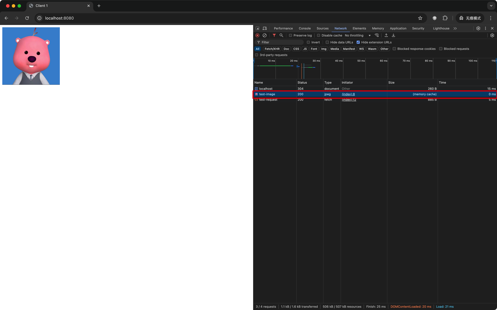

这就是一个利用缓存存储策略的最小化场景，即验证以下情况：

**请求资源时，响应携带 Cache-Control: max-age=3600**

- 服务器在响应中设置了 `Cache-Control: max-age=3600` 指令时，这意味着浏览器（以及任何中间缓存，如代理服务器）被指示可以将该响应存储在缓存中，并且可以在接下来的 3600 秒内重用该缓存，而无需再次向服务器请求；


如上文所说，`Cache-Control` 的取值有多种，且缓存存储策略不仅受 `Cache-Control` 头控制， `Expires` 头也需要考虑，我们继续验证：

**请求资源时，响应携带 Cache-Control: no-store**

- 服务器在响应中设置了 `Cache-Control: no-store` 指令时，这意味着浏览器（以及任何中间缓存，如代理服务器）被要求不存储任何关于客户端请求和服务器响应的任何部分；


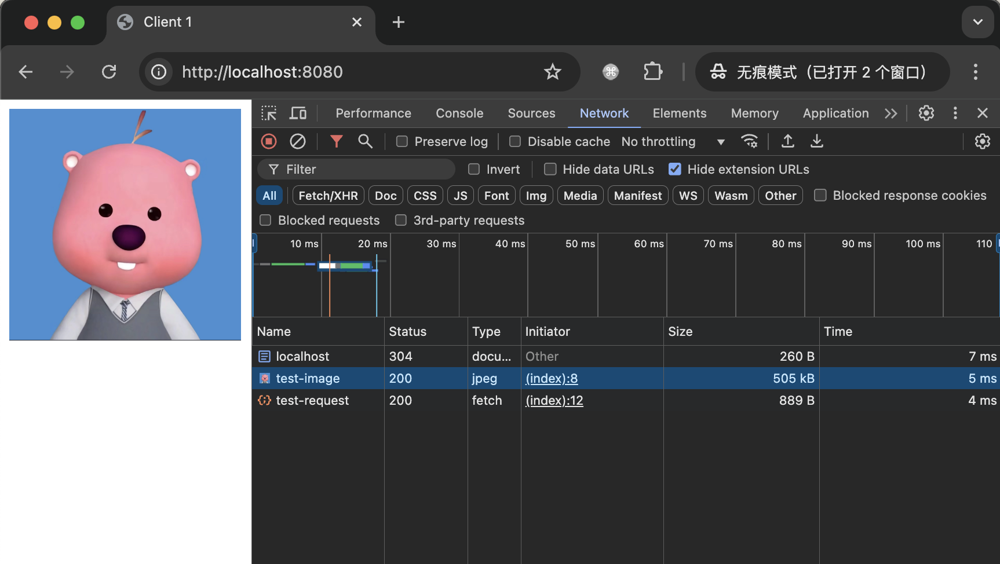


**请求资源时，服务端的响应没有携带 Cache-Control，携带了 Expires**

- 如果响应中仅设置了 `Expires` 头，浏览器的将根据 `Expires` 头来决定缓存策略。`Expires` 头提供了一个具体的日期/时间，告诉浏览器该资源在这个时间点之前都被认为是新鲜的，可以从缓存中直接获取而无需向服务器再次请求；

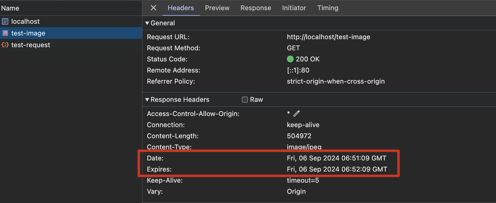


**请求资源时，服务端的响应同时携带了 Cache-Control 和 Expires**

相关文档：https://developer.mozilla.org/en-US/docs/Web/HTTP/Caching#expires_or_max-age

- 如果响应中同时设置了 `Cache-Control` 和 `Expires`，浏览器会优先考虑 `Cache-Control` 的指令。例如，如果 `Cache-Control` 设置为 `max-age=3600`（资源应在 3600 秒后被视为过期），这将覆盖 `Expires` 头中的任何日期/时间设置；

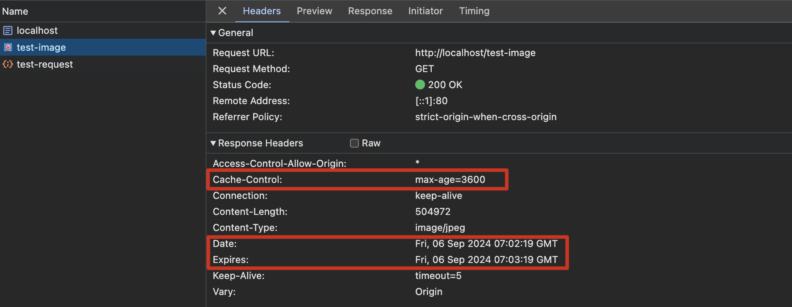


**请求资源时，服务端的响应没有携带 Cache-Control 和 Expires**

相关文档：https://developer.mozilla.org/en-US/docs/Web/HTTP/Caching#heuristic_caching

- 在没有明确缓存指令的情况下，大多数现代浏览器会尝试使用启发式方法来决定资源的缓存时间。这通常基于资源的最后修改时间（如果有的话）：
  - 如果响应中设置了 `Last-Modified` ，浏览器会使用这个日期与响应被接收的时间之间的差值的一部分（如10%）来估算一个缓存时间。这意味着如果资源经常被更新，它可能会被较短时间地缓存；如果很少更新，可能会被较长时间地缓存；
  - 如果如果响应中没有设置 `Last-Modified` ，浏览器可能默认设置资源不被缓存。这种行为可以防止浏览器缓存已经变更的资源；
  - `Content-Type` 可能影响缓存决策。静态资源（如图片、CSS）更可能被缓存相对较长的时间，动态内容可能不会被缓存或只短暂缓存；

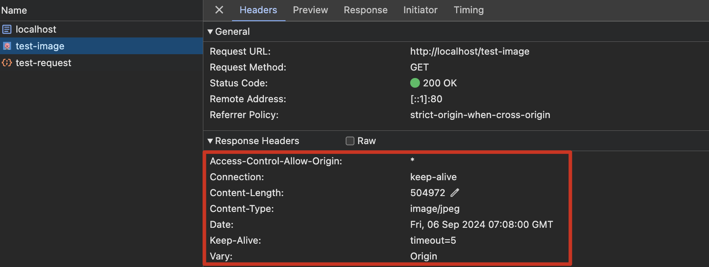

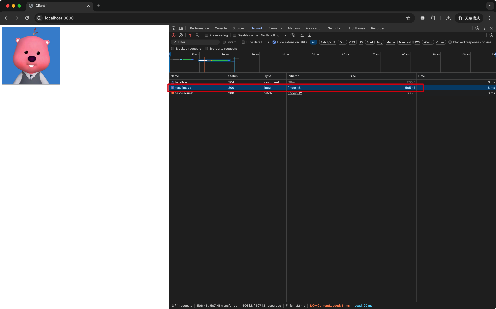

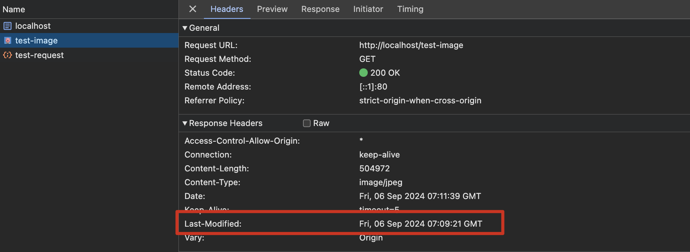

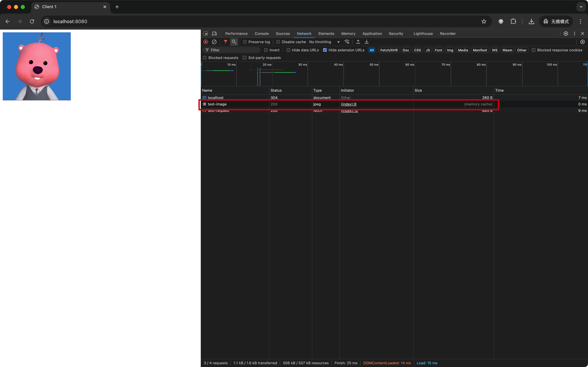

上面的几种情况中，没有包含 `Cache-Control: no-cache`、`Cache-Control: max-age=0` 的情况，此时需要结合缓存存储策略与缓存验证策略，我们后面再进行介绍。

此外，我们一直没有提及 `private` 和 `public` 这两种取值，它们明显与 `Cache-Control`  的其他取值不同，表示对缓存存储位置的限制，因此通常都会和 `max-age` 等组合使用，如果没有明确指定，浏览器默认按照 `public` 处理（即上面我们验证的情况都是 `public`） 。

`public` 表示响应可以被任何缓存区缓存，`private` 表示响应只能被单个用户的浏览器缓存，不适用于共享缓存（如 CDN、代理服务器）。如果仅考虑浏览器缓存的情况，`private` 取值会产生什么影响？


**请求资源时，服务端的响应携带了 Cache-Control: private**

- 在仅考虑浏览器缓存的情况下，`public` 和 `private` 实际上没有明显的区别。即使指定了 ` Cache-Control: private`，同一设备、同一用户的两个不同网站客户端，同一资源的缓存也是共享的；


Client 1 请求 `test-image`，此时无缓存：

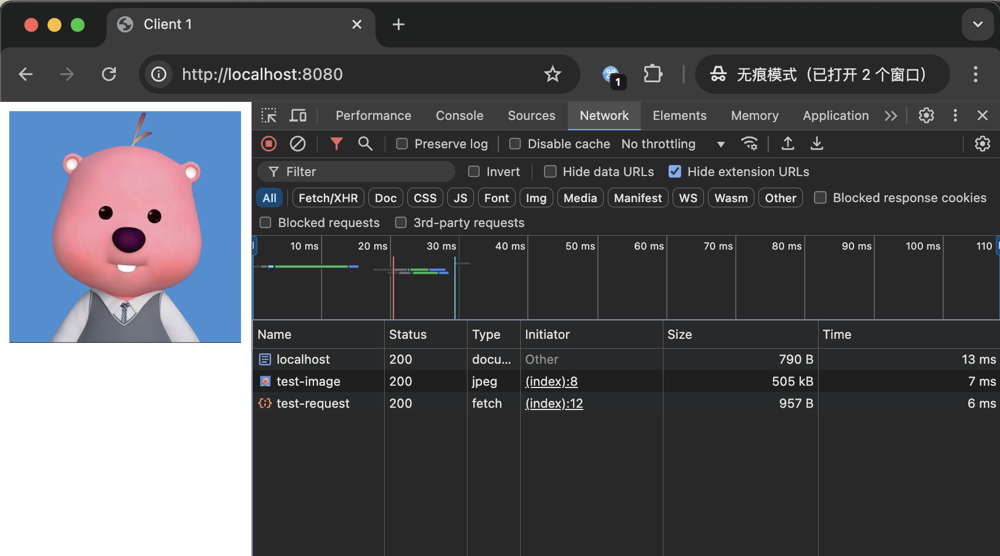

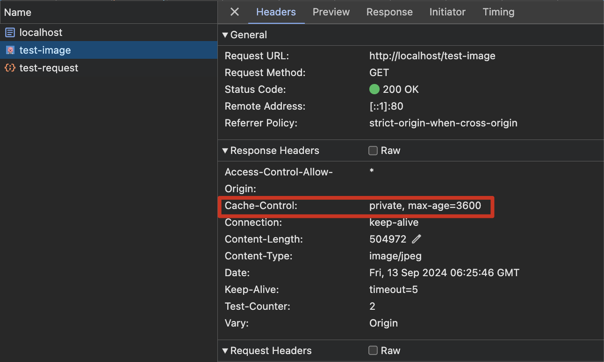

Client 2 请求 `test-image`，首次请求直接命中了缓存：

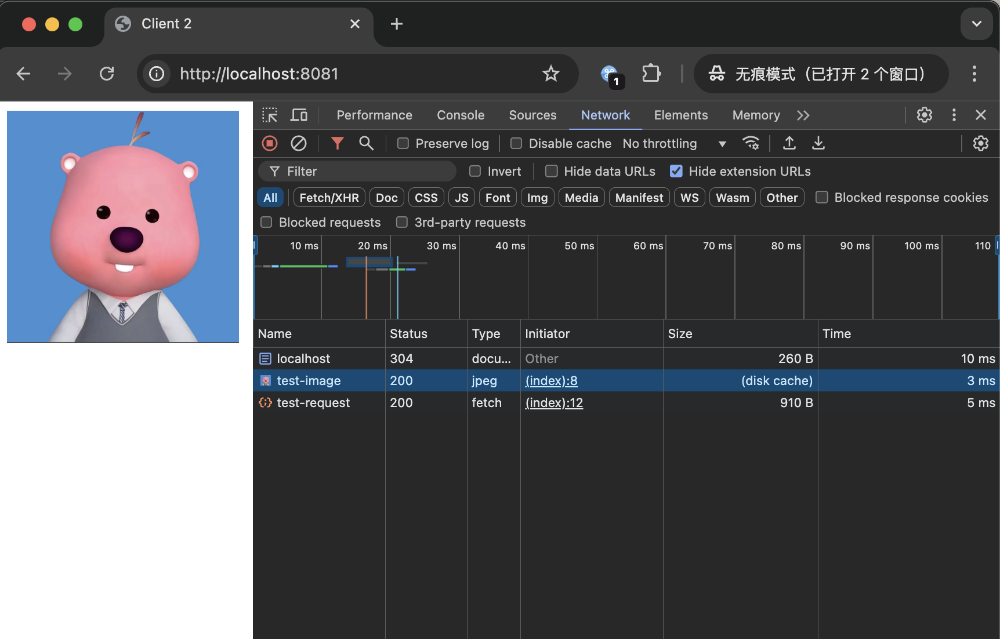


Client 2 清除缓存刷新，重新回源获取资源：

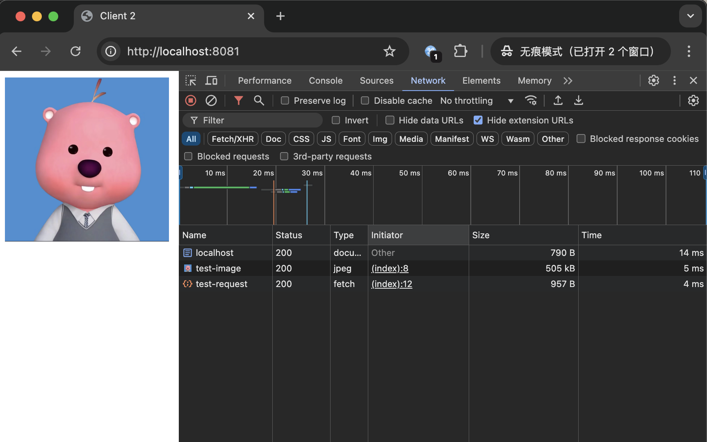

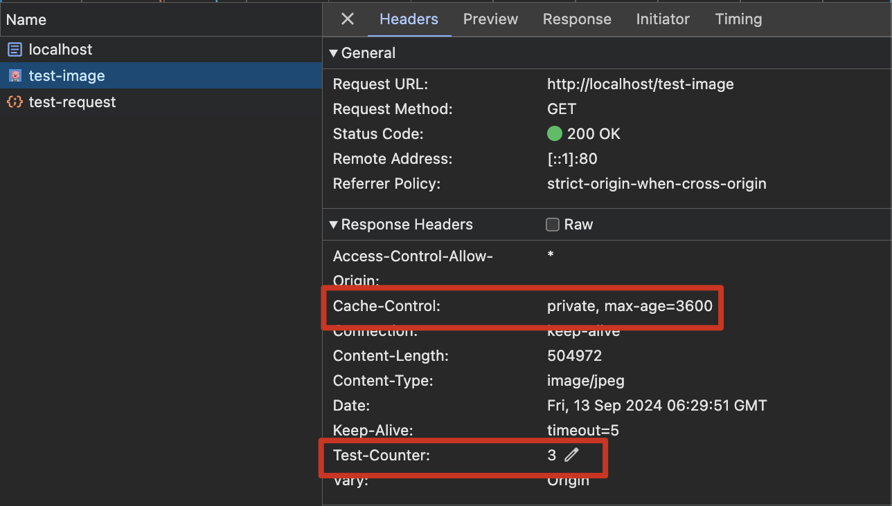

Client 1 也直接使用了更新后的缓存：

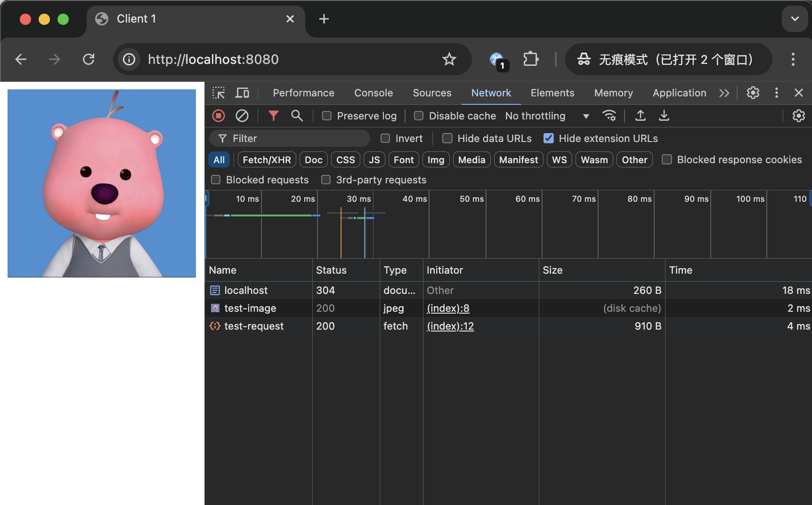

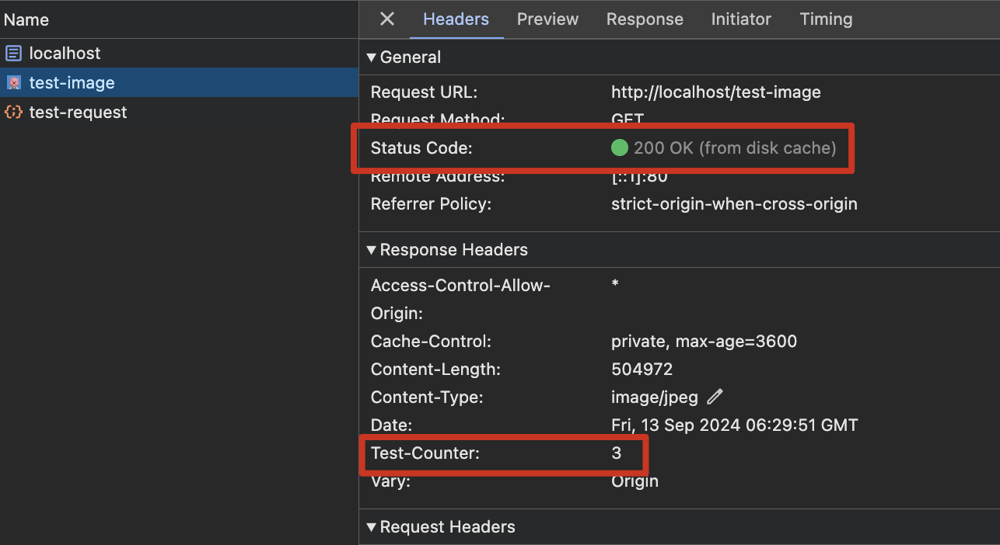

由此可见，Client 1 与 Client 2 使用的是同一份 `test-image` 缓存。


### 浏览器地址栏

直接在浏览器的地址栏中输入 URL 去请求资源时，浏览器通常不会遵循常规缓存策略。因为这种请求行为往往更倾向于获取到最新的资源（即使用缓存，也会频繁验证缓存是否有效）避免因为使用了过时的缓存而导致问题。

这与通过页面内元素（如 `` 标签）发起的请求略有不同，后者更依赖并遵循 HTTP 缓存头的指示进行资源的缓存和重用。


### Fetch API

相关文档：https://developer.mozilla.org/en-US/docs/Web/API/RequestInit#cache

> 浏览器在其 HTTP 缓存中查找与请求匹配的响应。如果匹配并且是[新鲜的](https://developer.mozilla.org/en-US/docs/Web/HTTP/Caching#fresh_and_stale_based_on_age)，它将从缓存中返回。如果有匹配项但已[过期](https://developer.mozilla.org/en-US/docs/Web/HTTP/Caching#fresh_and_stale_based_on_age)，则浏览器将向远程服务器发出[条件请求](https://developer.mozilla.org/en-US/docs/Web/HTTP/Conditional_requests)。如果服务器指示资源未发生变化，则将从缓存中返回。否则将从服务器下载资源并更新缓存。如果不匹配，浏览器将发出正常请求，并使用下载的资源更新缓存。


按照 MDN 文档，fetch API 在默认情况下，会查询并使用浏览器 HTTP 缓存。但是我在本地使用 `localhost` 进行测试时，发现通过 fetch API 发起 HTTP 请求，并不会使用浏览器的 HTTP 缓存，我猜测应该是 `localhost` 的影响，许多现代浏览器在处理 `localhost` 或其他本地开发环境时会采取特殊的缓存策略。这是为了方便开发和调试，确保开发者总是能看到最新的更改。

为了验证我的猜测，我将 Server 地址改为 `127.0.0.1`：

```html
<!DOCTYPE html>
<html lang="en">
<head>
  <meta charset="UTF-8">
  <meta name="viewport" content="width=device-width, initial-scale=1.0">
  <title>Client 1</title>
</head>
<body>
  
  <script>
    (async function() {
      const response = await fetch('http://127.0.0.1/test-request');
      const data = await response.json();
      
      console.log(data);
    })();
  </script>
</body>
</html>


```

果然，此时 fetch API 的行为符合我的预期：

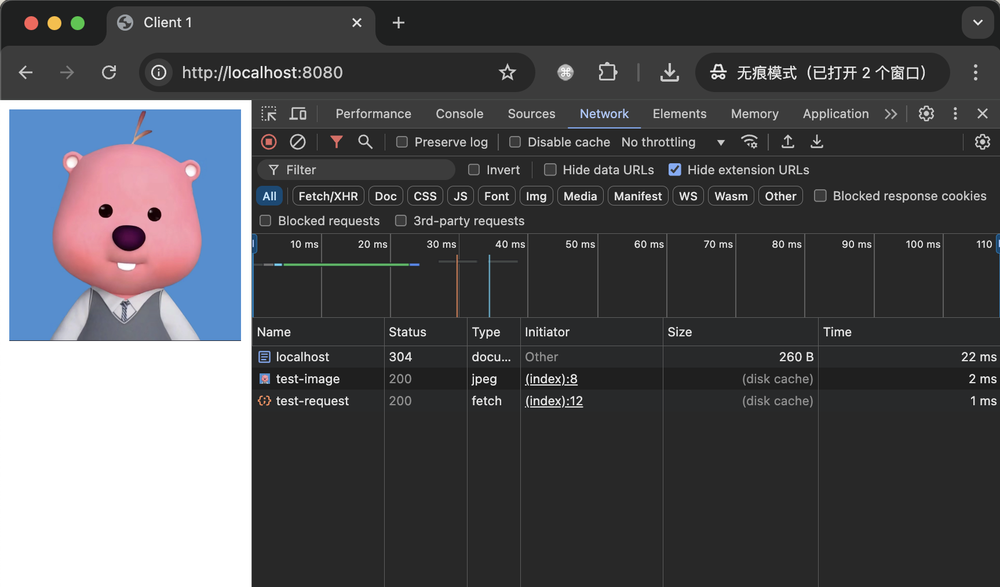


### **Dist Cache & Memory Cache**

通过 Cache-Control 或 Expires 设置我们可以将 HTTP 响应数据存储到本地，但具体将缓存存储在哪里？这里涉及到 Disk Cache 和 Memory Cache。Disk Cache（磁盘缓存）和 Memory Cache（内存缓存）有这几种区别：

- 存储位置：disk cache：存储在硬盘上；memory cache：存储在 RAM 中；
- 持久性：disk cache：关闭浏览器后仍然保留；memory cache：关闭浏览器后会清除读取；
- 读写速度：disk cache：较慢；memory cache：快；
- 存储容量：disk cache：容量较大 memory cache：容量有限；
- 使用场景：disk cache：适合大文件和长期存储；memory cache：适合小文件和频繁访问的资源；
- 资源类型：disk cache：各种类型的资源；memory cache：主要用于脚本、样式表等；


浏览器会根据资源类型、大小和访问频率等因素决定使用哪种缓存，同时这两种缓存还会相互转化。

初始缓存决策：

- 文件大小：较小的文件更可能被存储在 Memory Cache 中；
- 访问频率：频繁访问的资源更可能被保存在 Memory Cache 中以提高访问速度；
- 资源类型：如 JavaScript 和 CSS 文件更倾向于存储在 Memory Cache 中；
- 可用内存：当系统内存充足时，浏览器可能更倾向于使用 Memory Cache；

从 Disk Cache 到 Memory Cache 的转换：

- 频繁访问：存储在 Disk Cache 中的资源被频繁访问，浏览器可能会将其转移到 Memory Cache 中以提高访问速度；
- 页面重新加载：页面重新加载时，浏览器可能会将 Disk Cache 中的资源可能会被加载到 Memory Cache 中；

从 Memory Cache 到 Disk Cache 的转换：

- 内存压力：系统内存不足时，浏览器可能会将 Memory Cache 中的资源转移到 Disk Cache 中；
- 长时间未访问：存储在 Memory Cache 中的资源长时间未被访问，浏览器可能会将其移动到 Disk Cache 中；


我们继续基于上面的场景进行验证，首先修改 Server 端代码：

```js
router.get('/:path*/test-css', async (ctx) => {
  	...
  
    ctx.type = 'text/css';
    ctx.set('Cache-Control','max-age=3600');
    
    ...
})

router.get('/:path*/test-js', async (ctx) => {
  	...
    
    ctx.type = 'application/javascript';
    ctx.set('Cache-Control','max-age=3600');
    
  	...
})

router.get('/:path*/test-image', async (ctx) => {
  	...
    
    ctx.type = 'image/jpeg';
    ctx.set('Cache-Control', 'max-age=3600');

    ...
})

router.get('/:path*/test-large-image', async (ctx) => {
  	...
    
    ctx.type = 'image/jpeg';
    ctx.set('Cache-Control', 'max-age=3600');
    
  	...
})

router.all('/:path*/test-request', async (ctx) => {
  	...

    ctx.type = 'json';
    ctx.set('Cache-Control', 'no-store');
    
  	...
});
```

修改 Client 端代码：

```html
<!DOCTYPE html>
<html lang="en">
<head>
  <meta charset="UTF-8">
  <meta name="viewport" content="width=device-width, initial-scale=1.0">
  <title>Client 1</title>
  <link rel="stylesheet" href="http://localhost/test-css">
  <script src="http://localhost/test-js"></script>
</head>
<body>
  
  
  <script>
    (async function() {
      const response = await fetch('http://localhost/test-request');
      const data = await response.json();
      
      console.log(data);
    })();
  </script>
</body>
</html>

```


当系统内存充足时，浏览器可能更倾向于使用 Memory Cache，因此各类静态资源都被存储在了 Memory Cache 中：

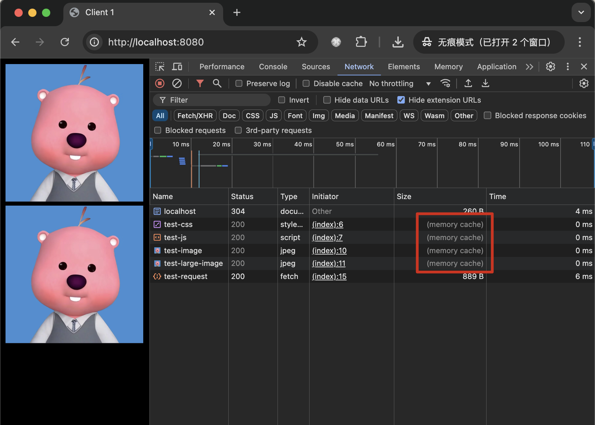

如果一个存储在 Memory Cache 中的资源长时间未被访问，它可能会被移动到 Disk Cache 中，因此一段时间后再次访问页面，原本在  Memory Cache 中的缓存被转移到 Disk Cache 中：

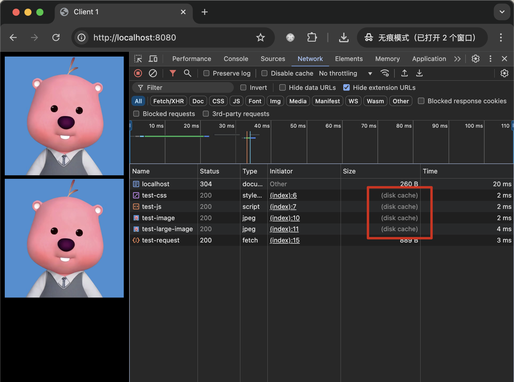

存储在 Disk Cache 中的资源被频繁访问，浏览器可能会将其转移到 Memory Cache 中以提高访问速度，因此连续刷新页面后，Disk Cache 中的缓存又重新被转移到 Memory Cache 中：

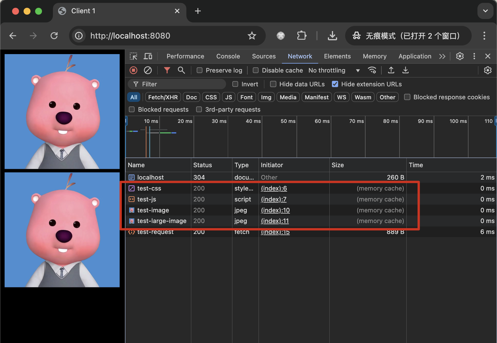

### 请求影响响应

同时还需要考虑的是，请求会影响响应的 `Cache-Control` 等缓存相关头部的生成与取值，例如：

- 请求 `Cache-Control` 头部：如果客户端请求包含 `Cache-Control`，服务器可能会响应相同的指令。例如：客户端 `Cache-Control: max-age=0` 可能导致服务器返回短期或无缓存的响应；
- 请求 `Pragma` 头部：旧式的 `Pragma: no-cache` 可能导致服务器禁用缓存；
- 请求 `Authorization` 头部：包含身份验证信息的请求可能导致服务器设置 `Cache-Control: private`；
- 请求 `Cookie`：包含用户特定信息的 `Cookie` 可能导致服务器设置私有或短期缓存；


针对这些情况，我们也进行验证：


## 缓存校验策略

通过 `Cache-Control` 或 `Expires` 设置我们可以将 HTTP 响应数据存储到本地，但此时并不意味着后续浏览器会直接从缓存中读取数据并使用，因为它无法确定本地缓存的数据是否可用（可能已经失效），还必须借助一套鉴别机制来确认才行。


